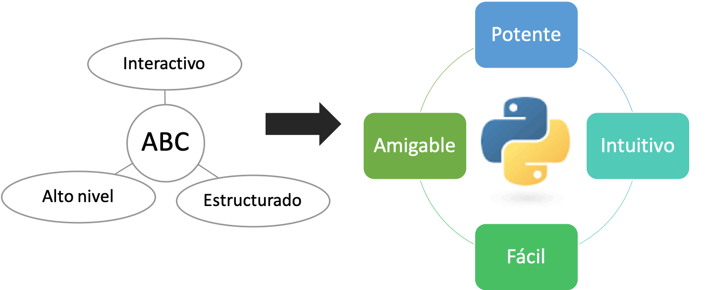
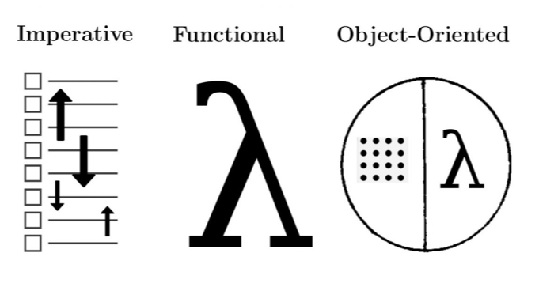
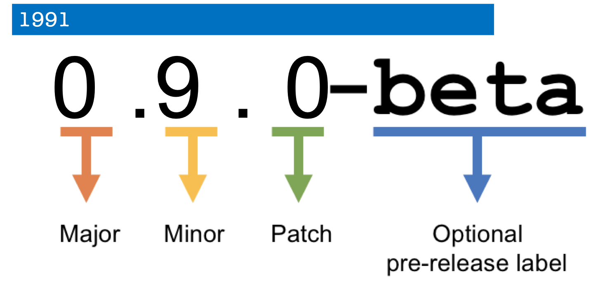

```{r setup, include=FALSE}
knitr::opts_chunk$set(echo = FALSE)
```


```{css, echo = FALSE}
/* From https://github.com/yihui/xaringan/issues/147  */
.scroll-output {
  height: 80%;
  overflow-y: scroll;
}
/* https://stackoverflow.com/questions/50919104/horizontally-scrollable-output-on-xaringan-slides */
pre {
  max-width: 100%;
  overflow-x: scroll;
}

```


# Historia


.full-width[.content-box-blue[Creador de Python: **Guido van Rossum**]]

.pull-left[

```{r, out.width = "200px",fig.align='center'}
knitr::include_graphics("https://upload.wikimedia.org/wikipedia/commons/6/66/Guido_van_Rossum_OSCON_2006.jpg")
```

.tiny[[Entrevista](https://www.youtube.com/watch?v=J0Aq44Pze-w)]

]


.pull-right[

- Originario de los Paises Bajos 

- Titulo: Matemáticas y computación 

- Investigador del Centrum Wiskunde & Informatics (CWI)


```{r, out.width = "250px",fig.align='center'}
knitr::include_graphics("https://pbs.twimg.com/media/EpSJbFwWEAQWebe.jpg")
```

]


---

## Ideas de Python 

Python fue creado para ser:

```{r, out.width = "850px",fig.align='center'}

```


.full-width[.content-box-red[Busca tener: **Legibilidad**]]

---
## ¿Qué es python?


- Lenguaje de programación interpretado

--

- Sintaxis de código legible

--

- Lenguaje de programación multiparadigma

--

```{r, out.width = "550px",fig.align='center'}

```


.tiny[
[Mas información](https://www.python.org/about/gettingstarted)
]


---
## Versiones de python

Python tuvo su primera verisión al público en 1991, y a continuado versionando de forma similar.

```{r, out.width = "750px",fig.align='center'}

```


---
## Python ¿2 o 3?

- ¿Qué versión de python nos conviene? 

--

- ¿Porqué?

---
## Python ¿2 o 3?

```{r, out.height = "550px",fig.align='center'}
knitr::include_graphics("https://res.cloudinary.com/practicaldev/image/fetch/s--SFU6R2gs--/c_limit%2Cf_auto%2Cfl_progressive%2Cq_auto%2Cw_880/https://thepracticaldev.s3.amazonaws.com/i/2agzfyqp1t6iqjrdihfv.png")
```


---
## Python ¿2 o 3?

```{r, out.width = "750px",fig.align='center'}
knitr::include_graphics("https://qph.fs.quoracdn.net/main-qimg-63812ebf5569d8d6e875f34de05f057b")
```


---
## Intalación

Puedes leer los requisitos en [github](https://github.com/AnaBVA/pythonCCG_2021) y seguir los pasos para la instalación. 

En este curso usaremos:

- Python 3 

```{r, out.width = "200px",fig.align='center'}
knitr::include_graphics("https://miro.medium.com/max/2560/0*8aY8pX5CoNGImZU4.png")
```

- PyCharm

```{r, out.width = "100px",fig.align='center'}
knitr::include_graphics("https://resources.jetbrains.com/storage/products/pycharm-edu/img/meta/pycharm-edu_logo_300x300.png")
```

---
## ¿Tienes python?


1. Abre una terminal 

--

2. Escribe `python` o `python3`


---

## ¿Qué versión tenemos?

Podemos checar la **versión** y el **PATH** de `python` de distintas maneras:

- Bash:

```{bash echo = TRUE}
python3 --version

which python3
```

---

## ¿Qué versión tenemos?

Podemos checar la **versión** y el **PATH** de `python` de distintas maneras:

--

- En python:

  1. Abre una terminal 

  2. Escribe `python` o `python3`


Checamos la **versión**
```{python echo=TRUE}
import sys
sys.version
```

--
Checamos el **PATH**
```{python echo=TRUE}
print(sys.path)
```

---
## PyCharm


```{r, out.width = "500px",fig.align='center'}
knitr::include_graphics("https://resources.jetbrains.com/storage/products/pycharm/img/meta/pycharm_logo_300x300.png")
```


---
## PyCharm

Tips:

- Agregar un interpretador de python (puedes usar conda env o virtual env)

--

- Executar el codigo en la *Consola Python* usando **Ctrl/Alt + Shift + E**

--

- Cambiar el nombre de la variable en todo el script utilizando `Refactor` 

  - Seleciona la  variable -> Click derecho -> `Refactor` -> `Rename`

  - **Shift + F6**

--

- Buscador **Cmd/Ctrl + F**

--

- Cambios recientes en tu archivo o projecto **Alt + Shift + C**

--

- Duplicar la lína de código **Cmd/Ctrl + D**

--

- `# todo`: Permite crear comentarios para saber donde te quedaste

---

## Ecosistema de Python

```{r, out.width = "600px",fig.align='center'}
knitr::include_graphics("https://www.researchgate.net/publication/332799309/figure/fig1/AS:753947908272130@1556766597837/Schematic-view-of-the-Python-scientific-software-ecosystem-Figure-taken-from-Jake.png")
```

---

## Anaconda

```{r, out.width = "600px",fig.align='center'}
knitr::include_graphics("https://miro.medium.com/max/3624/1*O5Jgl-KFuvUyujAZhXHYlQ.png")
```

---

## Bioconda

```{r, out.width = "300px",fig.align='center'}
knitr::include_graphics("https://cdn-ak.f.st-hatena.com/images/fotolife/b/biodata/20170113/20170113232841.png")
```

```{r, out.width = "700px",fig.align='center'}
knitr::include_graphics("https://media.springernature.com/m685/springer-static/image/art%3A10.1038%2Fs41592-018-0046-7/MediaObjects/41592_2018_46_Fig1_HTML.jpg")
```

.tiny[
[Grüning, Björn, et al. "Bioconda: sustainable and comprehensive software distribution for the life sciences." Nature methods 15.7 (2018): 475-476.](https://www.nature.com/articles/s41592-018-0046-7)
]

---
##  Rosalind

.tiny[
[Pagina web de Rosalind](http://rosalind.info/problems/locations/)
]

```{r, out.width = "700px",fig.align='center'}
knitr::include_graphics("https://i.pinimg.com/originals/44/d7/4f/44d74fdeb808d07087b8ed3e1756bf50.png")
```

---
## Ejercicio de Rosalind 

.content-box-blue[
Hacer el ejercico de [Rosalind:Installing Python](http://rosalind.info/problems/ini1/)
]

---
## Python como calculadora

Python sirve como calculadora y te permite hacer operaciones
--
```{python echo=TRUE}
50 - 5*6 / 4
(50 - 5*6) / 4
```

--
```{python echo=TRUE}
5 ** 2 # potencias
```

---
## Python como calculadora

```{python echo=TRUE}
ancho = 20
alto = 5 * 9
ancho * alto
```

---
## Ejercicio de Rosalind 

.content-box-blue[
Hacer el ejercico de [Rosalind: Variables and Some Arithmetic](http://rosalind.info/problems/ini2/)
]