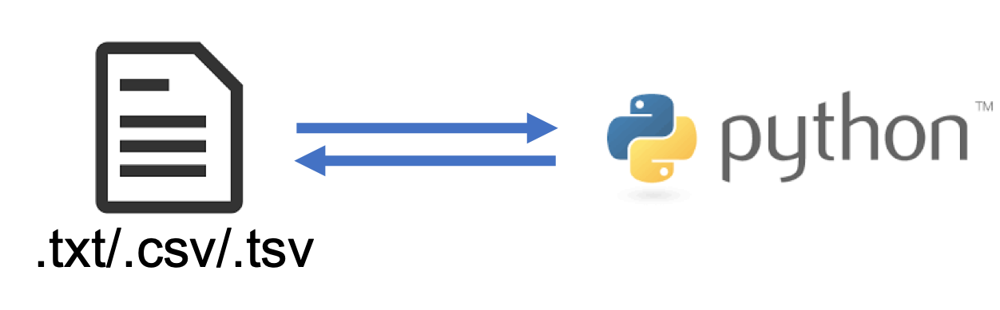

```{r setup, include=FALSE}
knitr::opts_chunk$set(echo = FALSE)
```


# ¿Cómo cambiar el input?

Dar una variable al script permite no tener que modificar el código cada vez que se cambia dicha variable. 

```{r, out.width = "600px", fig.align = "center"}
knitr::include_graphics("https://assets.spe.org/dims4/default/7536b25/2147483647/strip/true/crop/739x473+0+0/resize/800x512!/quality/90/?url=http%3A%2F%2Fspe-brightspot.s3.amazonaws.com%2Fb2%2F2e%2Fb5d9f53904e8784805d72ffe9516%2Fgettyimages-1138383136.jpg")
```

---
# ¿Cómo cambiar el input?

Dar una variable al script permite no tener que modificar el código cada vez que se cambia dicha variable. 

--

Existen varias formas de hacerlo:

--

- `ìnput()`: Esta función nos permite pasar el valor directo a una variable

--

- `open()`: Leyendo archivos 

--

- *Argumentos*: Pasando argumentos al archivo

---
class: inverse, center, middle

# `input()`

---
# `input()`

Con la función `ìnput()` podemos pedir la variable al usuario desde terminal 

--

```{python, eval=F, echo = T}
dna = input()
print('La secuencia de DNA es: {dna}')
```

--
<br><br>

.center[.content-box-green[**Vamos a pyCharm**]]

---
## Ejercicio 

.content-box-blue[

Utilizando el problema de: ¿Cuantas `A`, `C`, `G` y `T` hay en la secuencia? 

Cambia tu script para que la secuencia se la des sin modificar tu archivo. 

Resuelve el problema de [Rosalind: Counting DNA Nucleotides](http://rosalind.info/problems/dna/)


.tiny[
`dna = 'AGCTTTTCATTCTGACTGCAACGGGCAATATGTCTCTGTGTGGATTAAAAAAAGAGTGTCTGATAGCAGC'`
] 

]

- Escribe un programa que te regrese la cantidad de nucleotidos

- Input: secuencia de DNA en la consola

- Output: un mensaje y el resultado

--
.content-box-blue[
Además agrega un mensaje de salida
]

---
## Ejercicio de Rosalind 

Si terminas, puedes hacer el siguiente ejercicio.

.content-box-blue[
Hacer el ejercico de [Rosalind:Transcribing DNA into RNA](http://rosalind.info/problems/rna/)
]


---
class: inverse, center, middle

# `open()`: Leyendo archivos 

---
# `open()`: Leyendo archivos 

Podemos leer archivos de texto y usar estos como *Input*.

```{r, out.width = "700px", fig.align = "center"}

```

---
# `open()`: Leyendo archivos 

Podemos leer archivos de texto y usar estos como *Input*.

## Biología

En Bioinformática tenemos varios formatos de archivos de **texto** que necesitaremos leer. Ejemplos:

--

- Archivos `FASTA` de DNA o proteínas

--

- Archivos `FASTAQ` con secuencias de DNA

--

- Archivos de salida de programas (eg. BLAST)

--

- Archivos `HTML` 

--

- Otros... 

---
## Archivos Binarios

Archivos que contienten bytes

```{r, out.width = "500px", fig.align = "center"}
knitr::include_graphics("https://edteam-media.s3.amazonaws.com/community/original/f660e5be-b0ca-436c-b77e-44fd49a07148.jpg")
```

--

- A demás de los archivos comprimidos (eg. `ZIP files`)

---
## Leer un archivo

- Podemos acceder un archivo usando `open()`. Necesita como argumento el archivo de texto que deseamos leer. 

--

```{python, eval=F, echo = T}
my_file = open("dna.txt")
```

--
<br><br>

.center[.content-box-green[**Vamos a pyCharm**]]

---
## Leer un archivo

- Podemos acceder un archivo usando `open()`. Necesita como argumento el archivo de texto que deseamos leer. 

--

- También necesitamos el método `read()` para **leer** el contenido.

--

```{r, out.width = "700px", fig.align = "center"}
knitr::include_graphics("https://s.libertaddigital.com/2019/01/04/leersintiempo.jpg")
```

---
## Leer un archivo

- Podemos acceder un archivo usando `open()`. Necesita como argumento el archivo de texto que deseamos leer. 

--

- También necesitamos el método `read()` para **leer** el contenido.

--

```{python, eval=F, echo = T}
# Abriendo el archivo
my_file = open("dna.txt")
# Leyendo el archivo
my_file_contents = my_file.read()
```

--

Se puede guardar el nombre del archivo en una variable.

```{python, eval=F, echo = T}
# Agregando el nombre del archivo como variable
my_file_name = "dna.txt"
# Abriendo el archivo
my_file = open(my_file_name)
# Leyendo el archivo
my_file_contents = my_file.read()
# Mostrando el contenido
print(my_file_contents)
```

--

.center[.content-box-green[**Vamos a pyCharm**]]

---
## ¿Qué errores podemos tener?

--

Error cuando no encuentra el archivo

```{python, eval=F, echo = T}
my_file = open("rna.txt")
```

--

¿Qué está mal?

```{python, eval=F, echo = T}
my_file_name = "dna.txt"
my_file = open(my_file_name)
print(my_file)
```

---
## Nuevas lineas

¿Qué pasa si imprimo la secuencia dentro de una oración de texto?

```{python, eval=F, echo = T}
# Agregar el nombre del archivo como variable
my_file_name = "dna.txt"

# Leer el archivo
my_file = open(my_file_name)
my_dna = my_file.read()

# Calular la longitud
dna_length = len(my_dna)

# Mostrar mensaje
print("The sequence is " + my_dna +  " and length is " + str(dna_length))

```

--
<br>

.center[.content-box-green[**Vamos a pyCharm**]]

---
## Nuevas lineas

Python lee el archivo como: 

.content-box-red[`'ACTGTACGTGCACTGATC\n'`]

--

`\n` es un caracter especial que agrega una nueva linea.

--

Podemos quitarla usando el método `rstrip()`. El cual remueve cualquier caracter al final de la cadena, el default son espacios `" "`. 

---
## Nuevas lineas

```{python, eval=F, echo = T}
# Agregar el nombre del archivo como variable
my_file_name = "dna.txt"

# Leer el archivo
my_file = open(my_file_name)
my_file_contents = my_file.read()

# Quitar el caracter de nueva linea \n
my_dna = my_file_contents.rstrip("\n")

# Calular la longitud
dna_length = len(my_dna)

# Mostrar mensaje
print("The sequence is " + my_dna +  " and length is " + str(dna_length))

```

--
<br>

.center[.content-box-green[**Vamos a pyCharm**]]

---
## Nuevas lineas

Es posible escribir varios métodos en la misma linea. 

--

En vez de:

```{python, eval=F, echo = T}
my_file_contents = my_file.read()
my_dna = my_file_contents.rstrip("\n")
```

--

Se puede escribir:

```{python, eval=F, echo = T}
my_dna = my_file.read().rstrip("\n")
```

---
## Ejercicio

.content-box-blue[
¿Cuál es el porcetaje de `AT` y `GC` en la secuencia del archivo `dna.txt`

`dna.txt = 'ACTGTACGTGCACTGATC'`?
]

- Escribe un programa que te regrese el porcentaje de  `AT` y `GC` pero que te 
pregunte la **ruta** al archivo de DNA.

- Output: un mensaje y el resultado


---
class: inverse, center, middle

# `open()`: Escribiendo archivos 

---
# `open()`: Escribiendo archivos 

Así como abrimos un archivo y lo leímos en python, podemos escribir un archivo desde python.

--

```{r, out.width = "600px", fig.align = "center"}
knitr::include_graphics("https://encrypted-tbn0.gstatic.com/images?q=tbn:ANd9GcQ9escDQSBplC0SZW-rLLH3JYXsA-87DdMVXrxST10ZKnP0YpnCKvfYv86Bqu0au2TYqjc&usqp=CAU")
```

---
# `open()`: Escribiendo archivos 

Así como abrimos un archivo y lo leímos en python, podemos escribir un archivo desde python.


---
# `open()`: Escribiendo archivos 


Necesitamos `open()` pero con otras especificaciones

--

.content-box-green[

`r`- **Read   ** -  Valor *default*. Abre y lee un archivo. *Error si no existe*

`a`- **Append ** -  Abre un archivo por apendice y crea un archive si no existe

`w`- **Write  ** -  Abre un archivp para escribir y crea un archive si no exite

`x`- **Create ** -  Crea un archivo específico y regresa error si ya existe
]

--

.content-box-red[**Impotante**]

- Si abrimos un archivo que ya existe usando `w`, se va a **reescribir**.
 
- Si abrimos un archivo que ya existe usando `a`, se **añadirá** la información al final del contenido existente.

---
# `open()`: Escribiendo archivos


```{python, eval=F, echo = T}
my_file = open("out.txt", "w")
my_file.write("Hello world")
```

--
<br>

.center[.content-box-green[**Vamos a pyCharm**]]

---
class: inverse, center, middle

# `.close()`: Cerrar 

Es importante cerrar cuando hayamos terminado de **leer** o **escribir**. 

--

Usamos el método `.close()` sin argumentos.

```{python, eval=F, echo = T}
my_file = open("out.txt", "w")
my_file.write("Hello world")
# Cerrar el archivo
my_file.close()
```

---
## Ejercicio 

.content-box-blue[
Crea un archivo fasta a partir de la secuencia de DNA que está en `dna.txt`

Ejemplo de un archivo fasta:
```
>sequence_name
ATCGACTGATCGATCGTACGAT
````

]

- Lee el archivo `dna.txt`

- Input: `dna.txt` Secuencia de DNA

- Output: `dna.fasta` Archivo de texto con formato fasta


